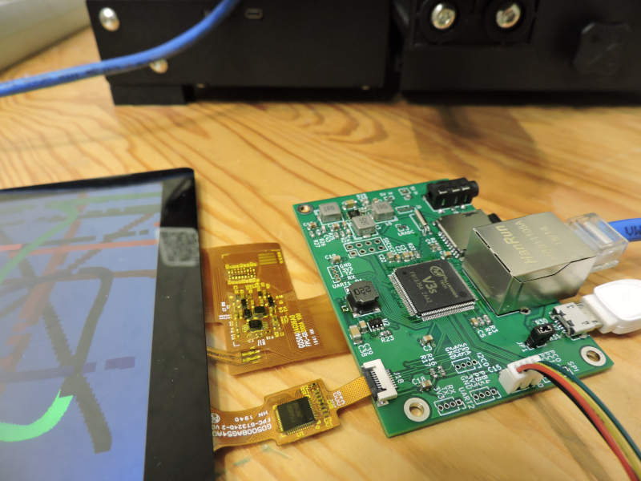
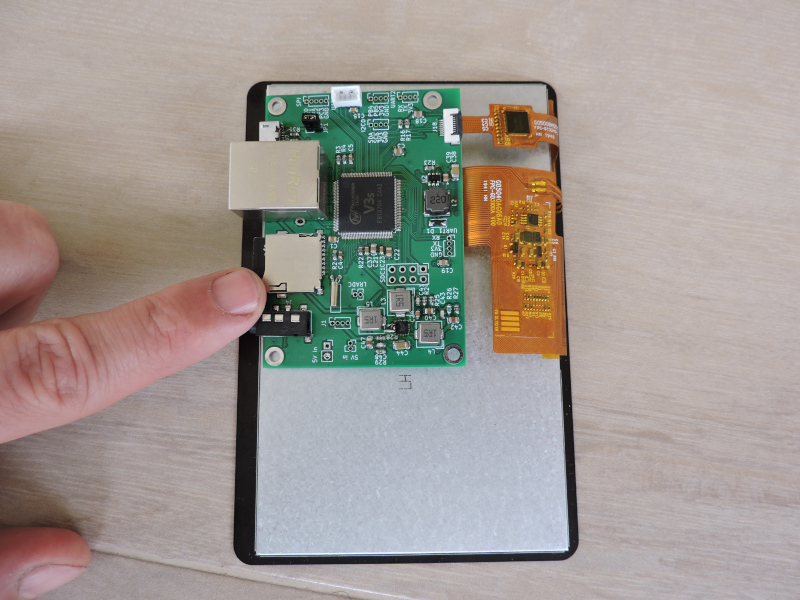
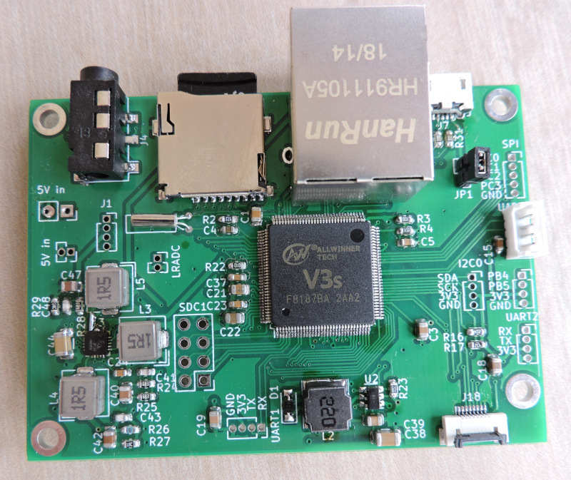
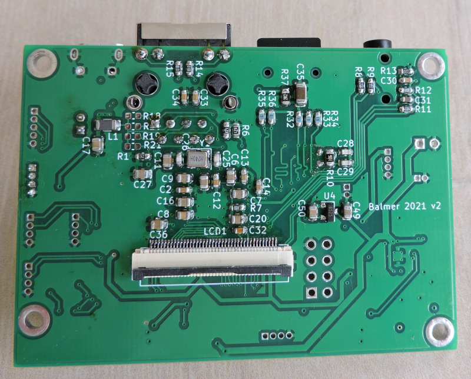
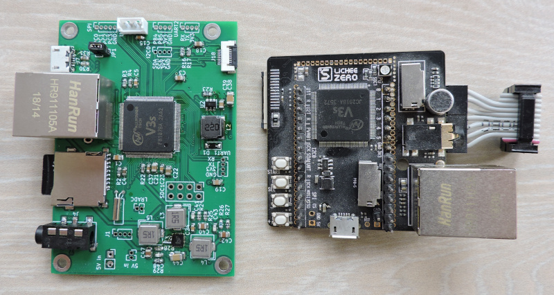
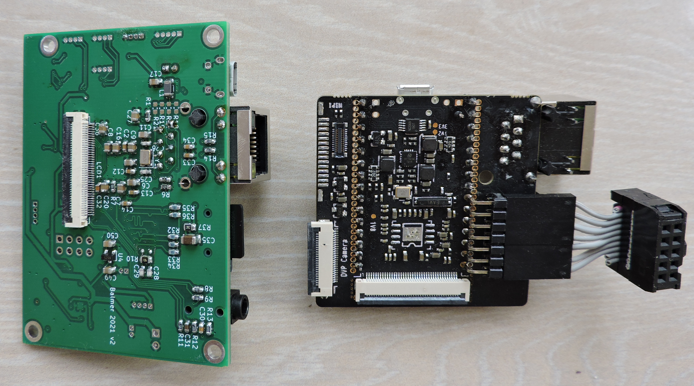

# Balmer Allwinner V3S KICAD scematic & pcb

Allwinner V3S - это пожалуй один из наиболее дешёвых system on chip для embedded linux.

Перечислю его ключевые особенности.
* встроенные 64 мегабайта DRAM
* RGB интерфейс для подключения дисплея
* встроенный PNY для Ethernet 100 Mbit
* USB 2.0 OTG
* встроенный DAC и усилитель для наушников

Это позволяет сделать достаточно дешёвый одноплатник.

Обратите внимание!!!! Плата разведена для Step-Down на EA3036. Микросхема EA3036C имеет несколько другой pinout. К сожалению мне прислали EA3036C, и поэтому на плате есть некрасивое место с её вкорячиванием.

Плата разведена под дисплей с 800x480 с capacitive touch (G05012AG02A1, G050AGZ085A1).

### Сравним с Lichee PI

По размеру мой вариант несколько больше. Но за счёт расположенных разъёмов конечный вариант будет явно компактнее. Разводка Lichee PI мне нравится как пример максимально плотного монтажа. Для отладки это нормально. Но в реальной жизни непонятно, что делать с этими случайным образом раскиданными разъёмами.

### Информация
* [Схема в pdf формате](info/balmer_allwinner_v3s_v2.pdf)
* [Информация, как собирать linux](info/Buildroot_AllwinnerV3S.pdf)

